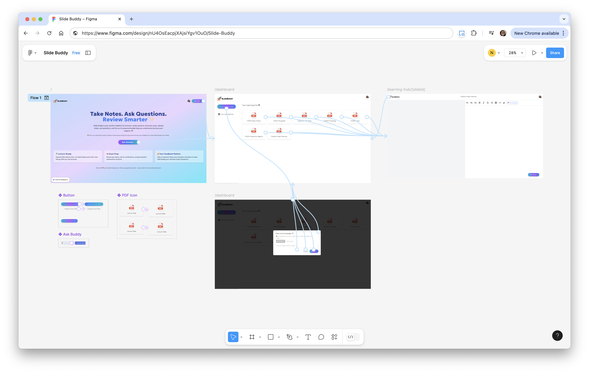

# Slide Buddy 🚀


## Table of Contents

<!-- TOC start (generated with https://github.com/derlin/bitdowntoc) -->

   * [**Overview**](#overview)
      + [Features](#features)
      + [Technologies Used](#technologies-used)
      + [Project Directory Structure](#project-directory-structure)
   * [**Getting Started**](#getting-started)
      + [Prerequisites](#prerequisites)
      + [Installation](#installation)
         - [1. Clone the repository](#1-clone-the-repository)
         - [2. Environment Variables](#2-environment-variables)
         - [3. Running the Project](#3-running-the-project)
- [**Project Report**](#project-report)
   * [1. General](#1-general)
      + [1.1. Problem Statement](#11-problem-statement)
         - [Relevance in the Future:](#relevance-in-the-future)
      + [1.2. Solution Architecture](#12-solution-architecture)
         - [Visual Prototype](#visual-prototype)
      + [1.3. Legal, Open Source Consideration, and Business Model](#13-legal-open-source-consideration-and-business-model)
      + [1.4. Competition Analysis](#14-competition-analysis)
         - [Competitor Comparison Table](#competitor-comparison-table)
         - [SWOT Analysis for Slide Buddy](#swot-analysis-for-slide-buddy)
   * [2. Implementation](#2-implementation)
      + [2.1. UI Implementation](#21-ui-implementation)
         - [a. Design](#a-design)
         - [b. Novel Features](#b-novel-features)
         - [c. Usability/Performance](#c-usabilityperformance)
      + [2.2. Back-End Implementation](#22-back-end-implementation)
         - [a. Architecture](#a-architecture)
         - [b. Implementation](#b-implementation)
         - [c. Authentication](#c-authentication)
         - [d. Setup Automation](#d-setup-automation)
         - [e. Other Novelties](#e-other-novelties)

<!-- TOC end -->

## Overview

> _"Slide Buddy’s here to light your way,_  
> _Through notes and questions every day._  
> _Upload, explore, and understand,_  
> _With AI’s help, you’ll take command." ✨_  

**Slide Buddy** is here to make studying simpler and enjoying! 🚀 It’s your go-to tool for taking notes, asking questions, and reviewing slides with ease. Built with modern tools like **Next.js**, **Tailwind CSS**, and **Tiptap**, and and supercharged by **Google Generative AI**, Slide Buddy keeps everything intuitive and efficient.💡📚

### Features

- **User-friendly Authentication:** Secure login and signup with Clerk.  
- **Slide Management:** Upload and store slides seamlessly with Convex.  
- **Interactive Learning Tools:**
  - View slides and take note with Tiptap's rich-text editor.  
  - Get AI-powered clarifications and topic summaries to aid exam preparation.  
- **Reliable Monitoring:** Track errors and performance with Sentry.  
- **Responsive Design:** Enjoy a consistent experience across devices, powered by Tailwind CSS.


### Technologies Used

- **Frontend Frameworks:**
  - **Next.js:** React framework for server-side rendering and static site generation.  
  - **Tailwind CSS:** Utility-first CSS framework for styling.  
  - **shadcn/ui:** Accessible and reusable UI components for consistent design.  

- **Rich-Text Editing:**
  - **Tiptap:** Rich-text editor for annotations and note-taking.  

- **Backend and AI:**
  - **Convex:** Backend as a service for database and API management.  
  - **LangChain:** Handles text embeddings and database queries.  
  - **Google Generative AI:** Powers text generation and intelligent clarifications.  

- **Monitoring and Debugging:**
  - **Sentry:** Tracks errors and monitors performance for a seamless experience.  

### Project Directory Structure
The project folder's main structure:
* **Frontend (UI)**: Built with reusable components in `app/` and `components/`.
* **Backend**: Managed through API routes in `convex/`.
* **Styling**: Tailored using Tailwind CSS, integration with Shadcn/ui.
* **Static Assets**: Organized in the `public/` directory.

The following tree outlines the organization of files and folders of the Slide Buddy project. 👇
<details>
  <summary>Click to view full tree!🌳</summary>
  
  ``` bash

➜  course-project-project-18-edtech git:(main) tree -I "node_modules|dist|.git|coverage"

.
├── README.md
├── app
│   ├── (auth)
│   │   ├── sign-in
│   │   │   └── [[...sign-in]]
│   │   │       └── page.jsx
│   │   └── sign-up
│   │       └── [[...sign-up]]
│   │           └── page.jsx
│   ├── api
│   │   └── slide-loader
│   │       └── route.js
│   ├── dashboard
│   │   ├── _components
│   │   │   ├── Header.js
│   │   │   ├── SideBar.js
│   │   │   └── UploadSlideDialog.js
│   │   ├── layout.js
│   │   └── page.js
│   ├── favicon.ico
│   ├── fonts
│   ├── global-error.jsx
│   ├── globals.css
│   ├── layout.js
│   ├── learning-hub
│   │   ├── [slideId]
│   │   │   └── page.js
│   │   └── _components
│   │       ├── LearningHubHeader.js
│   │       ├── NoteEditor.js
│   │       ├── NoteExtension.js
│   │       └── SlideViewer.js
│   ├── page.js
│   └── provider.js
├── components
│   └── ui
│       ├── button.jsx
│       ├── dialog.jsx
│       ├── input.jsx
│       ├── progress.jsx
│       └── sonner.jsx
├── components.json
├── configs
│   └── AIModel.js
├── convex
│   ├── _generated
│   │   ├── api.d.ts
│   │   ├── api.js
│   │   ├── dataModel.d.ts
│   │   ├── server.d.ts
│   │   └── server.js
│   ├── langchain
│   │   └── db.js
│   ├── myAction.js
│   ├── notes.js
│   ├── schema.js
│   ├── slideStorage.js
│   └── user.js
├── instrumentation.js
├── jsconfig.json
├── lib
│   └── utils.js
├── middleware.js
├── next.config.mjs
├── package-lock.json
├── package.json
├── postcss.config.mjs
├── public
│   ├── figma.png
│   ├── landing-page.png
│   ├── logo.png
│   ├── pdf-file.png
│   └── presentation.png
├── sentry.client.config.js
├── sentry.edge.config.js
├── sentry.server.config.js
└── tailwind.config.js

23 directories, 55 files

  ```

</details>

## Getting Started

Follow these steps to set up and run the Slide Buddy project.

### Prerequisites

Make sure you have the following installed:

- **Node.js** (>= 16.x, recommended 18.x for best compatibility)  
  - Download from [Node.js Official Website](https://nodejs.org/).
- **npm** (>= 8.x, comes with Node.js)  

### Installation

#### 1. Clone the repository

Open a terminal and run the following commands:

```
git clone git@github.com:nguyenngocyennga/slide-buddy.git
cd slide-buddy
```

#### 2. Environment Variables

Create a `.env.local` file in the root directory and add the following environment variables for Convex, Clerk, Google AI Studio (Gemini) and Sentry.

```sh
CONVEX_DEPLOYMENT=
NEXT_PUBLIC_CONVEX_URL=

NEXT_PUBLIC_CLERK_PUBLISHABLE_KEY=

NEXT_PUBLIC_CLERK_SIGN_IN_URL=/sign-in # No need to modify
NEXT_PUBLIC_CLERK_SIGN_UP_URL=/sign-up # No need to modify

GOOGLE_API_KEY=

SENTRY_AUTH_TOKEN=
```

#### 3. Running the Project

You can run the project in two ways:

**Option 1: One-Liner Command**

This command will install the dependencies and then run both the development server and the Convex backend in parallel all in one terminal.

```
npm run slide-buddy
```

**Option 2: Step-by-Step Setup**

Install the dependencies:

```
npm install
```

Start the development server:

```
npm run dev
```

In a separate terminal, start the Convex backend:

```
npx convex dev
```

---


# Project Description

## 1. General

### 1.1. Problem Statement

**The challenges students face:**

Managing lecture slides, notes, and exam preparation often requires juggling multiple tools. This fragmented workflow disrupts focus, wastes time, and complicates learning. Exam prep becomes even more daunting with the manual organization of notes and question generation.
- Too Many Tools: Students constantly switch between slide viewers, note-taking apps, and AI tools. This disrupts their workflow and wastes valuable time.
- Disorganized Conversations with AI: Existing AI tools don’t tie answers to specific lecture slides or notes. Students end up with fragmented conversations and must copy-paste answers back into their notes.
- Tedious Exam Prep: Organizing notes and creating practice questions takes hours. Without automation, it’s hard to focus on understanding concepts deeply.

**How Slide Buddy can help?**

**Slide Buddy** aims to solve this problem by integrating slide viewing, rich-text note-taking, and AI-powered learning tools into a single platform. The solution simplifies study workflows, saves time, and improves comprehension.
- Time Saved: Students can **save up to 3 hours per week** by having all tools in one place. No more switching apps or copy-pasting between tools.
- Efficient Exam Prep: AI-generated summaries and questions **cut revision time by up to 30%**, letting students focus on studying, not organizing.
- Better Retention: Context-aware note-taking and AI-driven explanations help students grasp concepts faster, **improving understanding by up to 40%**.

#### Relevance in the Future:
- Short-Term (2 Years): With increasing reliance on digital tools, Slide Buddy supports both in-person and remote learning environments.
- Medium-Term (5 Years): As AI improves, personalized learning tools like Slide Buddy will become more essential for competitive academics.
- Long-Term (10 Years): The tool’s architecture allows for continuous upgrades, making it adaptable to future educational trends and technologies.

### 1.2. Solution Architecture

The architecture of Slide Buddy integrates the following key components:

**1. Frontend**

- Built using **Next.js** for server-side rendering, dynamic UI, and responsive design.
- Integrated **Tiptap** for rich-text note-taking and annotations.
- Styled with **Tailwind CSS** for a clean, consistent user interface.

**2. Backend**

- Managed with **Convex**, providing scalable server-side logic and database management.
- **LangChain** enables text embeddings for advanced AI processing.
- Utilizes **Google Generative AI** to provide intelligent clarifications and study question generation.

**3. AI Features**

- Context-aware question answering based on lecture notes.
- Automatic generation of practice questions and topic summaries for exam prep.

**4. Error Monitoring**

- Configured with **Sentry** to monitor performance, detect bugs, and especially instant user feedback form with screen capture and video relay to provide actionable insights.

#### Visual Prototype

Visual mockups and prototypes were created to guide development, not only for this iteration but also act as a platform for future features prototypes. Please view the current prototype here: [[IT5007] Project 18 - Slide Buddy - Figma Prototype](https://www.figma.com/design/nU4OsEacpjXAjsiYgv1OuO/%5BIT5007%5D-Project-18---Slide-Buddy?node-id=0-1&m=dev&t=LQQEmUkK4wJp4TOv-1)




### 1.3. Legal, Open Source Consideration, and Business Model

**Open Source Usage and Licensing**

Slide Buddy is built on open-source technologies like Next.js, Tiptap, Tailwind CSS, and Convex. These tools make development faster and more reliable while ensuring compliance with established open-source licenses. While open-sourcing the project under an MIT license could support collaboration and community-driven improvements, unique features—like contextual AI workflows and modular architecture—can be considered to remain proprietary to protect the platform’s competitive edge.

**Business Model**

At this stage, Slide Buddy focuses on user acquisition and feedback through a **freemium model**. Core features, such as slide viewing, note-taking, and basic AI functionalities, are available for free, ensuring accessibility and encouraging adoption among students and educators. Premium features, like unlimited slide uploads, personalized flashcards, and advanced analytics, provide an opportunity for monetization. As the platform grows, subscription plans for individuals and institutions or enterprise licensing partnerships with schools and universities could open potential long-term revenue streams.

### 1.4. Competition Analysis

Slide Buddy integrates features that address gaps in the tools students commonly use:

#### Competitor Comparison Table

| **Tool** | **Strengths** | **Gaps** |
|-|-|-|
| **Notion** | Flexible workspace for note-taking, project management, and databases | No real-time annotation or lecture-specific workflows |
| **Mem.ai** | AI-driven organization for personal notes, focuses on workflow recall | Lacks integration with slides or tools for exam preparation |
| **StudyPotion** | Converts lecture materials into flashcards and interactive study aids | Limited note-taking capabilities and no contextual AI assistance |
| **NotebookLM** | Summarizes and interacts with uploaded documents using AI | Not optimized for live lectures or slide-based workflows |
| **OneNote** | Allows slide-linked notes and flexible formatting for various workflows | No built-in AI features for clarifications or automated exam prep tools |

**Why Slide Buddy stands out?**

Slide Buddy combines the best of these tools into one platform. Students can take notes along with slides in real-time, ask contextual questions, and generate exam materials—all without leaving the app. It’s designed for the modern student who needs everything at their fingertips.

#### SWOT Analysis for Slide Buddy

| **Strengths** | **Weaknesses** |
|-|-|
| Combines note-taking, AI assistance, and slide viewing in one platform | Limited initial resources for development |
| User-friendly, tailored for students | Early-stage project with scalability challenges |
| Freemium model encourages adoption | Requires ongoing AI feature improvements |
| **Opportunities** | **Threats** |
| Integration with LMS platforms to boost adoption | Established competitors with large user bases |
| Expansion into global markets with multilingual support | Competitors may replicate key features |
| Partnerships with educational content providers | User inertia toward existing tools |

Slide Buddy is an all-in-one platform and user-centric design to simplify learning workflows, with opportunities in LMS integration and global expansion, but faces challenges in scaling, competition from established tools, and the need for continuous innovation.

We owe the online community for their resources and tutorials, such as Antonio Erdeljac, Adrian Hajdin, and Rahul Sanap, for generously sharing.

## 2. Implementation

### 2.1. UI Implementation

#### a. Design

**Evaluation:**

- **Layout and Structure**: The main components such as the header, sidebar, and main content area are separated.
- **Color Scheme**: We use a consistent color scheme with gradients and background colors that enhance the visual appeal. Mostly minimal but with the gradient-styled buttons as visual cue.
- **Fonts**: We use the Geologica font from Google Fonts (to enhance displaying of Vietnamese, main language of one team member :D)
- **Buttons and Icons**: Buttons are styled uniformly with gradient backgrounds and hover effects. Icons are used appropriately to enhance the user experience.
- **Navigation**: The navigation is simple and clear. The use of Clerk for authentication ensures that the user experience is smooth. Routes like /learning-hub/[slideId] make context-specific navigation easy for users (breadcrumbs).

**UI Kit:**

- **Colors**: The project uses a combination of blue, purple, and cyan gradients for buttons and backgrounds as a signature.
- **Fonts**: Geologica font from Google Fonts.
- **Buttons**: Customized the shadcn/ui button using Tailwind CSS with gradient backgrounds and hover effects.
- **Icons**: Used icons from shadcn/ui in the sidebar and other components to enhance the user experience.

#### b. Novel Features

Some of our features that could be considered:
- **React Routing**: Next.js App Router for routing, which enables dynamic, modular routing (e.g., /learning-hub/[slideId]) for slide-specific interactions.
- **Real-time Updates**: We use Convex for real-time updates, ensuring that the user sees the latest data without needing to refresh the page.
- **AI Integration**: We integrate Langchain for text embedding and Google Generative AI for text generation, providing advanced features for note-taking and slide analysis. Users can ask questions or request clarifications directly tied to the context of specific slides.
- **Responsive Design and Advanced Animations**: We use Tailwind CSS to make sure the app adapts seamlessly to different screen sizes, from desktops to mobile devices, with animations, such as hover scaling effects on buttons and cards.
- **Rich-Text Note-Taking**: The integration of Tiptap provides flexible text editing capabilities, such as formatting, annotations, and AI-driven conversation.

#### c. Usability/Performance
**Evaluation:**
- **Broken URL Links**: All internal navigation links, login, logout, buttons are functional.
- **Form Validation**: We setup to specify that form only accept pdf type. Other visual cues, animations, toasts are also implemented. 
- **Performance**: The use of Next.js and Tailwind CSS ensures that the project is performant and responsive. However, since we integrate Sentry, there might be potential lag initially when setting up the project.
 
### 2.2. Back-End Implementation

#### a. Architecture
**Incoming request and request processing**
The back-end supports various incoming requests, including:

- User authentication and management via Clerk
- Slide upload and storage via Convex
- Real-time data updates via Convex
- Pdf processing and text embedding from Langchain
- AI-powered note-taking and slide analysis via Google Generative AI
- Error monitoring via Sentry

#### b. Implementation
**Heavy Back-end Technology**
- Convex: Used as the primary database and real-time data synchronization service. It handles user data, slide metadata, and notes.
- Langchain and Google Generative AI: Used for AI-powered note-taking and slide analysis for processesing text data and generating embeddings for efficient search and retrieval.

**Processing Incoming Requests**
- User Authentication: Clerk to authenticate users and manage sessions.
- Slide Upload and Storage: Convex to generate upload URLs, store slide metadata, and retrieve slide URLs.
- AI-powered Note-taking and Slide Analysis: Langchain and Google Generative AI to process text data and generate embeddings.
- Error Monitoring: Sentry to capture and log errors.

#### c. Authentication
- Clerk: Integrated for user authentication and session management. 

#### d. Setup Automation
**Scripts**
- `npm run slide-buddy`: This script installs dependencies and starts both the development server and the Convex backend in parallel.

#### e. Other Novelties
**Interactions between Back-end Services**
- Slide Upload and AI Analysis: The back-end fetches slide data from Convex, processes it using Langchain and Google Generative AI, and stores the results back in Convex.
- Real-time Data Updates: Convex provides real-time data synchronization, ensuring that users see the latest data without needing to refresh the page.

**Performance Enhancement**
- Convex: Provides efficient real-time data synchronization.
- Langchain and Google Generative AI: Provides fast and accurate text generation and embeddings.
